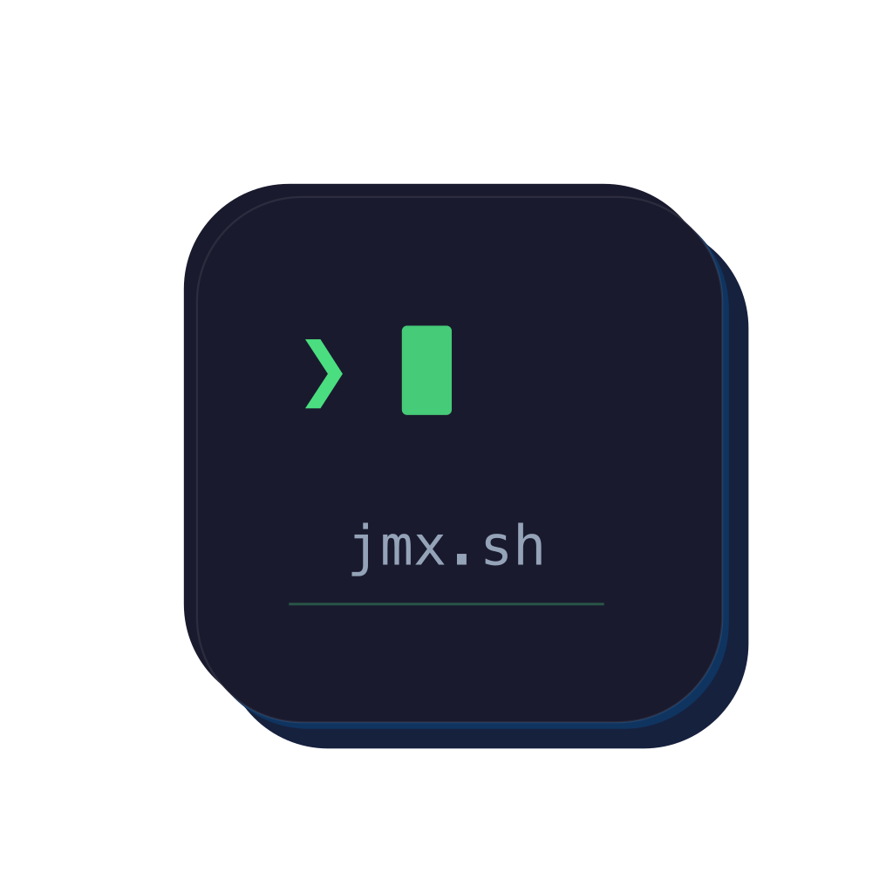

<p align="center">
  
  <br>
  <a href="https://github.com/nyg/homebrew-jmxsh"></a>
  <a href="https://jmx.sh/apt"></a>
  <br><br>
  <strong><a href="https://jmx.sh">jmx.sh</a></strong>
</p>

**jmx.sh** lets you connect to any JMX-enabled JVM, browse MBeans, read and write attributes, and
invoke operations — all from the comfort of your terminal.

> **Fork notice** — jmxsh is an actively maintained fork of
> [jiaqi/jmxterm](https://github.com/jiaqi/jmxterm), incorporating contributions from
> [LeMyst/jmxterm](https://github.com/LeMyst/jmxterm). The goal is to keep the project alive with
> regular updates and releases, dependency maintenance, and new features.

## Installation

### JAR (all platforms)

Download the latest [JAR from Releases](https://github.com/nyg/jmxsh/releases) and run:

```bash
java -jar jmxsh-<version>.jar
```

### Homebrew (macOS & Linux)

```bash
brew install nyg/jmxsh/jmxsh
```

### Debian/Ubuntu

```bash
# Add the GPG key and repository
curl -fsSL https://jmx.sh/apt/gpg.asc | sudo gpg --dearmor -o /usr/share/keyrings/jmxsh.gpg
echo "deb [arch=amd64 signed-by=/usr/share/keyrings/jmxsh.gpg] https://jmx.sh/apt stable main" | sudo tee /etc/apt/sources.list.d/jmxsh.list

# Install
sudo apt update && sudo apt install jmxsh
```

## Features

- **Interactive REPL** with tab completion and command history (JLine)
- **Remote & local connections** — connect via host:port, JMX URL, or local PID
- **JMXMP protocol support** — connect via `jmxmp://host:port` in addition to the default RMI protocol
- **Full MBean support** — browse domains, read/write attributes, invoke operations
- **Command chaining** — run multiple commands in one line with `&&`
- **Script mode** — automate JMX operations via files or piped input
- **Verbose control** — silent, brief, or verbose output modes
- **Cross-platform** — runs anywhere Java runs (JAR, DEB, RPM)
- **XDG Base Directory compliance** — command history stored in `$XDG_STATE_HOME/jmxsh/` (defaults to `~/.local/state/jmxsh/`), keeping your home directory clean

## Usage

```
$ java -jar jmxsh-<version>.jar
Welcome to jmx.sh, type "help" for available commands.
$> open localhost:9999
#Connection to localhost:9999 is opened
$> domains
#following domains are available
JMImplementation
java.lang
com.example
$> bean com.example:type=AppStats
#bean is set to com.example:type=AppStats
$> get RequestCount
#mbean = com.example:type=AppStats:
RequestCount = 42;
$> run resetStats
#calling operation resetStats of mbean com.example:type=AppStats
#operation returns:
null
$> close
$> quit
```

### Key Commands

| Command | Description |
|---|---|
| `open <host:port>` | Connect to a remote JMX endpoint (RMI) |
| `open jmxmp://<host:port>` | Connect to a remote JMX endpoint (JMXMP) |
| `open <pid>` | Attach to a local JVM by process ID |
| `domains` | List all MBean domains |
| `beans` | List all MBeans (optionally filter by domain with `-d`) |
| `bean <name>` | Select an MBean for subsequent operations |
| `info` | Show attributes and operations of the selected MBean |
| `get <attr>` | Read an MBean attribute |
| `set <attr> <value>` | Write an MBean attribute |
| `run <op> [args]` | Invoke an MBean operation |
| `close` | Disconnect from the JMX endpoint |
| `jvms` | List local Java processes |
| `help` | Show all available commands |

### JMXMP Connections

To connect using the JMXMP protocol instead of the default RMI:

```
$> open jmxmp://localhost:9999
#Connection to jmxmp://localhost:9999 is opened
```

Full service URLs are also supported: `open service:jmx:jmxmp://localhost:9999`

### Non-Interactive Mode

Run commands from a script file:

```bash
java -jar jmxsh-<version>.jar -l localhost:9999 --input commands.txt
```

Or pipe commands via stdin:

```bash
echo "open localhost:9999 && beans" | java -jar jmxsh-<version>.jar -n
```

## Documentation

- [Architecture](docs/dev/architecture.md)
- [Build Process](docs/dev/build-process.md)
- [Integration Tests](docs/dev/integration-tests.md)
- [E2E Tests](docs/dev/e2e-tests.md)

## License

Apache License 2.0 — see [LICENSE](LICENSE) for details.
