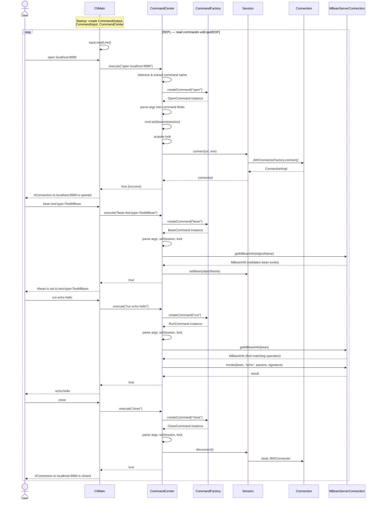

# Architecture

This document describes the internal architecture of jmxsh, focusing on the components involved in
the command execution flow.

## Command Execution Flow

The diagram below shows the sequence of interactions when a user runs the `open`, `bean`, `run`, and
`close` commands in a typical jmxsh session.

## Component Descriptions

### CliMain

The application entry point (`org.cyclopsgroup.jmxterm.boot.CliMain`). Parses CLI arguments (e.g.
`-l` for URL, `-n` for non-interactive mode, `-v` for verbose level), initializes the I/O layer and
`CommandCenter`, then enters the REPL loop that reads and dispatches user commands.

### CommandCenter

The central orchestrator (`org.cyclopsgroup.jmxterm.cc.CommandCenter`). Responsible for:

- **Parsing** raw command strings (handling comments `#`, chaining with `&&`, and argument
  tokenizing)
- **Creating** command instances via `CommandFactory`
- **Injecting** the `Session` into each command before execution
- **Thread-safe execution** using a `ReentrantLock` so commands run sequentially

### CommandFactory

A factory interface (`org.cyclopsgroup.jmxterm.CommandFactory`) implemented by
`PredefinedCommandFactory`. Loads command name → class mappings from a properties file
(`META-INF/cyclopsgroup/jmxsh.properties`) and creates a fresh command instance for each
execution. Supports aliases (e.g. `quit` → `exit`, `bye`).

### Command

The abstract base class (`org.cyclopsgroup.jmxterm.Command`) that all commands extend. Each
subclass:

- Is annotated with `@Cli(name="...")` for registration
- Defines options via `@Option` and arguments via `@Argument` on setter methods
- Implements `execute()` to perform its JMX operation
- Is **transient** — a new instance is created per execution (not reused)

### Session

An abstract class (`org.cyclopsgroup.jmxterm.Session`) that holds the current JMX state:

- The active `Connection` (JMX connector)
- The currently selected domain and bean
- The verbose level
- References to `CommandOutput` for writing results and messages

`SessionImpl` is the concrete implementation managed by `CommandCenter`. It is **not thread-safe** —
all access is synchronized through `CommandCenter`'s lock.

### Connection

An interface (`org.cyclopsgroup.jmxterm.Connection`) implemented by `ConnectionImpl`. Wraps a
`JMXConnector` and provides access to the `MBeanServerConnection`, the connection URL, and the
connector ID. Created when `Session.connect()` is called and destroyed on `Session.disconnect()`.

### MBeanServerConnection

The standard JMX interface (`javax.management.MBeanServerConnection`) obtained from the
`JMXConnector`. Commands use it to:

- Query MBean info (`getMBeanInfo`)
- Read/write attributes (`getAttribute`, `setAttribute`)
- Invoke operations (`invoke`)
- List domains and beans (`getDomains`, `queryNames`)

### I/O Layer

Abstractions for input and output (`org.cyclopsgroup.jmxterm.io`):

- **CommandInput** — reads user commands. Implementations: `JlineCommandInput` (interactive console
  with tab completion and history), `FileCommandInput` (script files), `InputStreamCommandInput`
  (piped input)
- **CommandOutput** — writes results and messages. `VerboseCommandOutput` is a decorator that
  filters output based on the verbose level (SILENT, BRIEF, VERBOSE)

### JavaProcessManager

Discovers local JVM processes for the `jvms` command and PID-based `open` connections
(`org.cyclopsgroup.jmxterm.jdk9.Jdk9JavaProcessManager`). Uses the `ProcessHandle` API to list
running JVMs and can attach a JMX management agent to a process by PID.
